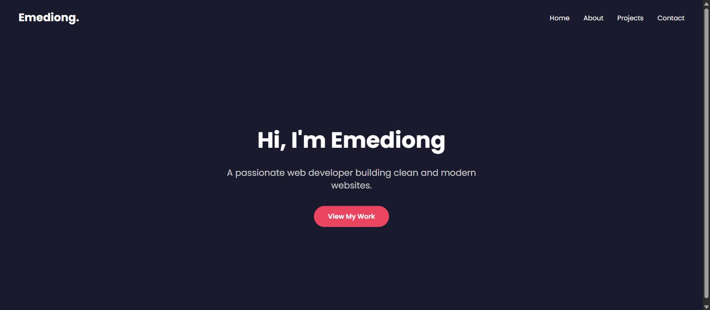

# My Portfolio

My personal developer portfolio — built with React to showcase my transition from project management into frontend development, along with the projects I've built while learning.

**Live site:** https://testingreactt.netlify.app/



## Sections

- **Home** — introduction and quick links to my work
- **About** — my background and pivot into frontend development
- **Projects** — [SoulSpace](https://github.com/talk2brownn/Soulspace), [Movie Search App](https://github.com/talk2brownn/movie-search-app), [GitHub Profile Finder](https://github.com/talk2brownn/github-profile-finder), and [Weather App](https://github.com/talk2brownn/weather-app), each with a live demo link
- **Contact** — ways to reach me

## Tech stack

- [React](https://react.dev/) (Create React App)
- [React Router](https://reactrouter.com/) for client-side routing between pages
- Plain CSS for styling

## Running it locally

```bash
git clone https://github.com/talk2brownn/My-portfolio.git
cd My-portfolio
npm install
npm start
```

The app will open at `http://localhost:3000`.

## Author

Built by [Emediong "Brown" Ubong Ekwere](https://github.com/talk2brownn).
